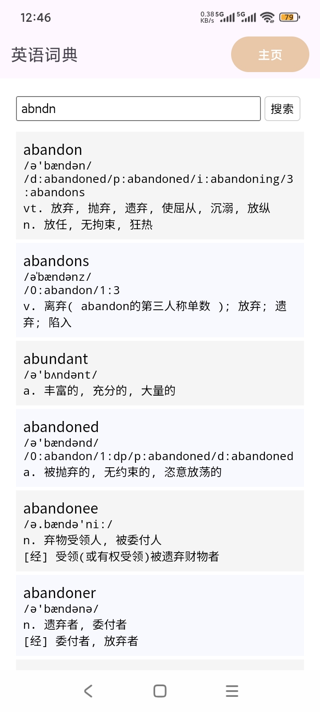
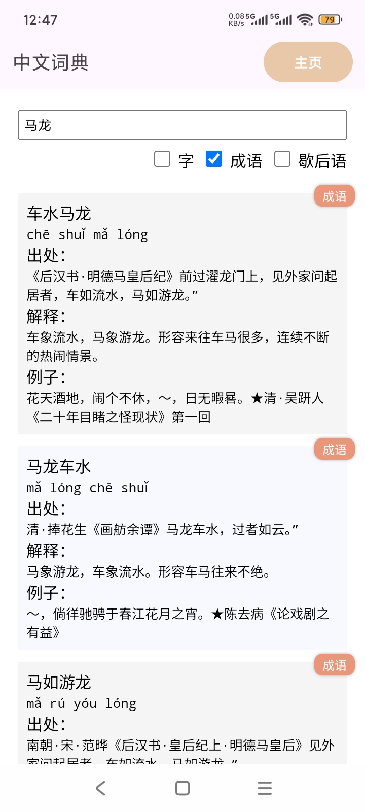

toolsbox 是一个免费、无广的安卓词典软件。自带英文、中文字、成语、歇后语词库，不用联网。还有一个 windows 同款软件 [dict](http://github.com/jjling2011/dict)。

  

#### 截图
  

#### 下载地址
[latest release](https://github.com/jjling2011/toolsbox/releases/latest)

#### 更新记录
[update-log.md](./docs/update-log.md)  

#### 感谢
中文词典数据来源：  
https://github.com/pwxcoo/chinese-xinhua  

英语词典数据来源：  
https://github.com/1eez/103976  
https://github.com/KyleBing/english-vocabulary  
https://github.com/skywind3000/ECDICT  

代码：  
https://chat.deepseek.com  

图标来源：  
https://icons8.com/icons/set/toolbox  
https://github.com/n3r4zzurr0/svg-spinners  

#### 吐糟
Android Studio 真不是人用的，写完就不想再打开，所以关 issue 了。
