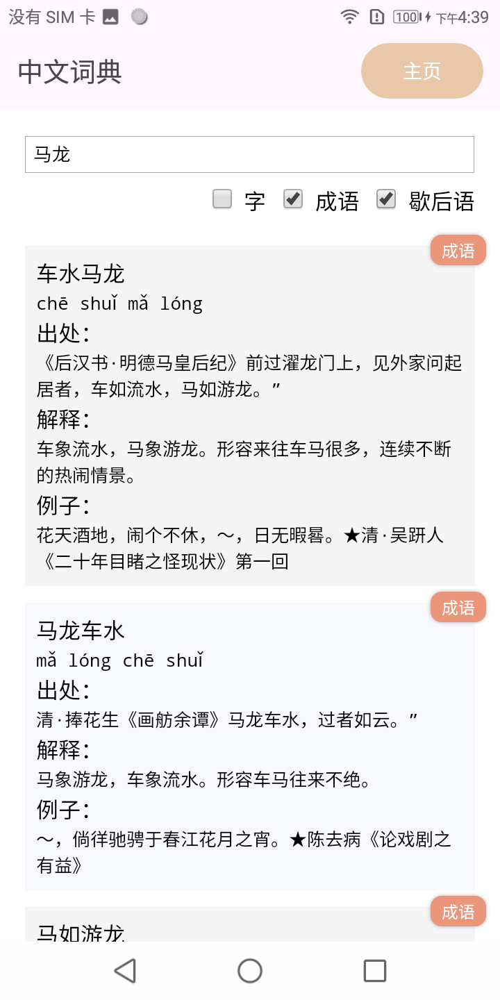

杂七杂八的工具箱

#### 功能
 * 列表计算器
 * 英语词典
 * 中文词典

#### 截图
  

#### 感谢
中文词典数据来源：  
https://github.com/pwxcoo/chinese-xinhua  

英语词典数据来源：  
https://github.com/1eez/103976  
https://github.com/KyleBing/english-vocabulary  
https://github.com/skywind3000/ECDICT  

代码：  
https://chat.deepseek.com  

图标来源：  
https://icons8.com/icons/set/toolbox  
https://github.com/n3r4zzurr0/svg-spinners  
